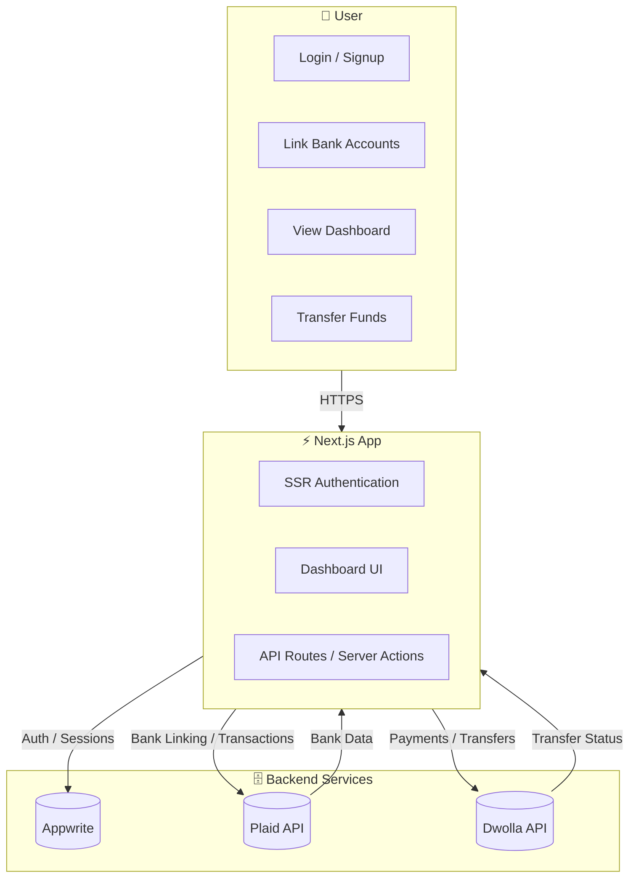
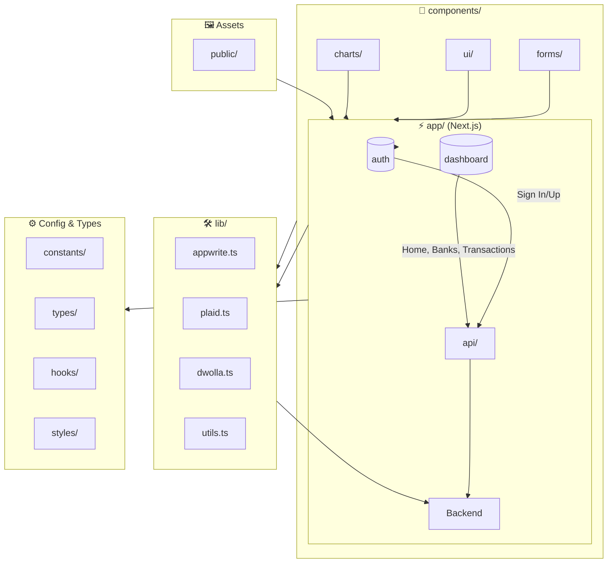

<h1> Horizon Banking Platform</h1>

Horizon is a **financial SaaS platform** built with **Next.js**. It connects multiple bank accounts, displays transactions in **real time**, enables **fund transfers** between users, and provides a complete **finance management** experience.

---

## 🤖 Introduction

Built with Next.js, Horizon connects to multiple bank accounts, displays transactions in real-time, allows users to transfer money to other platform users, and manages their finances altogether.

---

## ⚙️ Tech Stack

⚡ Next.js – React framework

🟦 TypeScript – Type safety

🗄 Appwrite – Authentication & backend services

🔗 Plaid – Bank account linking

💳 Dwolla – Payment transfers

📝 React Hook Form – Form management

✅ Zod – Schema validation

🎨 Tailwind CSS – Styling

📊 Chart.js – Data visualization

🧩 ShadCN – UI components

---

## 🔋 Features

* **Authentication** – Ultra-secure SSR authentication with validations & authorization
* **Connect Banks** – Integrates Plaid for multiple bank account linking
* **Home Page** – Overview: total balance, recent transactions, category spend & insights
* **My Banks** – Full list of connected banks with balances & account details
* **Transaction History** – Paginated & filterable per-bank transactions
* **Real-time Updates** – Changes reflected across relevant pages after linking accounts
* **Funds Transfer** – Secure transfers via Dwolla with recipient bank/user ID
* **Responsive Design** – Optimized for desktop, tablet & mobile
* **Code Architecture** – Clean structure & reusable components

---

## 📂 Project Structure (Tree)

```text
horizon-banking/
├── app/                  # Next.js app directory (routes, layouts, pages)
│   ├── (auth)/           # Authentication pages (sign-in, sign-up)
│   ├── (dashboard)/      # Dashboard pages (home, transactions, banks, transfers)
│   └── api/              # API routes for server actions
│
├── components/           # Reusable UI + feature components
│   ├── forms/            # Authentication & transfer forms
│   ├── ui/               # ShadCN & custom UI components
│   └── charts/           # Chart.js visualizations
│
├── lib/                  # API clients & utilities
│   ├── appwrite.ts       # Appwrite SDK setup
│   ├── plaid.ts          # Plaid API integration
│   ├── dwolla.ts         # Dwolla API integration
│   └── utils.ts          # Helper utilities
│
├── constants/            # Static configs & enums
├── types/                # TypeScript types
├── hooks/                # Custom React hooks
├── styles/               # Global Tailwind styles
├── public/               # Static assets (icons, logos, images)
├── .env.example          # Example environment variables
├── tailwind.config.ts    # TailwindCSS config
├── tsconfig.json         # TypeScript config
├── package.json          # Dependencies & scripts
└── README.md             # Documentation
```

---

## 🏗 Architecture Overview (Mermaid)



---

## 🗂 Visual Project Architecture (Mermaid)



---

## 🚀 Getting Started

### 1) Install dependencies

```bash
npm install
# or
yarn install
```

### 2) Configure environment variables

Copy `.env.example` → `.env` and set credentials for **Appwrite**, **Plaid**, and **Dwolla**.

### 3) Run the development server

```bash
npm run dev
# or
yarn dev
```

Then open **[http://localhost:3000](http://localhost:3000)**.

---

## 🔑 Environment Variables

```bash
# Appwrite
NEXT_PUBLIC_APPWRITE_ENDPOINT=
NEXT_PUBLIC_APPWRITE_PROJECT=
APPWRITE_API_KEY=

# Plaid
PLAID_CLIENT_ID=
PLAID_SECRET=
PLAID_ENV=sandbox # or development/production

# Dwolla
DWOLLA_KEY=
DWOLLA_SECRET=
DWOLLA_ENV=sandbox # or production
```

> Tip: Never commit `.env`—use `.env.local` for development and CI secrets for deployments.

---

## 🧰 Scripts

```json
{
  "scripts": {
    "dev": "next dev",
    "build": "next build",
    "start": "next start",
    "lint": "next lint"
  }
}
```

---

## 📦 Deployment

Deploy with **Vercel**:

* One-click: https://banking-five-gamma.vercel.app/
* Docs: [https://nextjs.org/docs/app/building-your-application/deploying](https://nextjs.org/docs/app/building-your-application/deploying)

---


